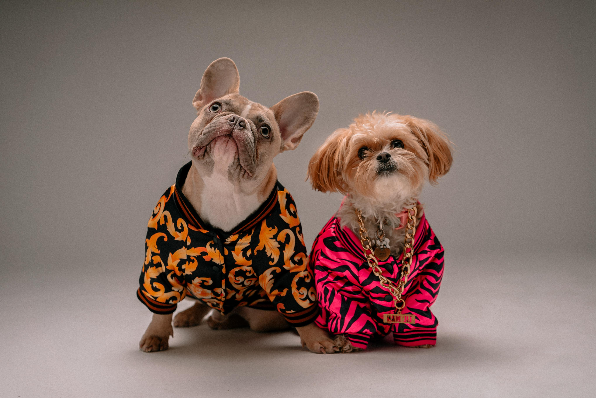
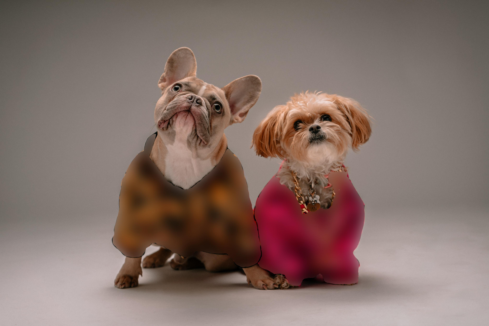
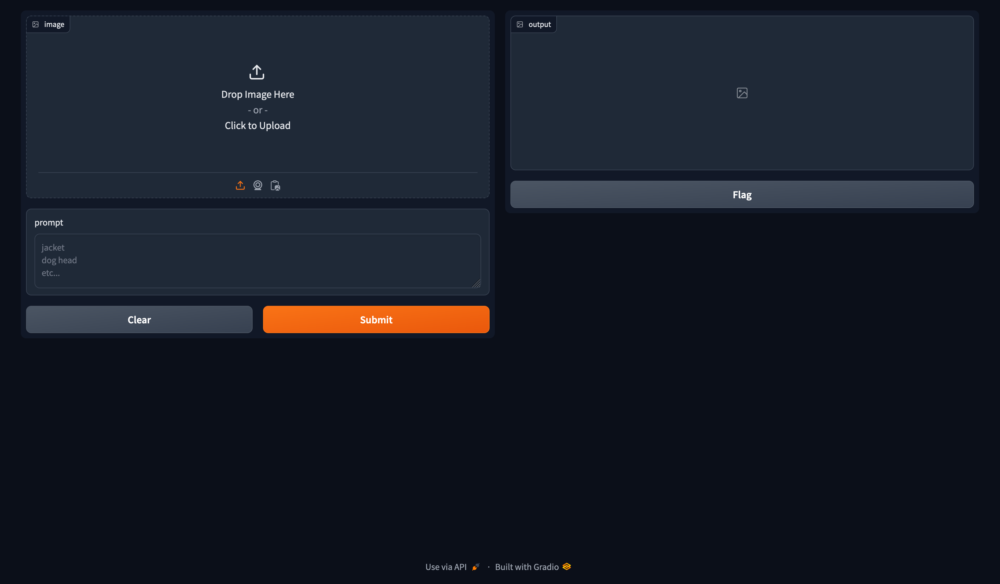

# Blur Image via Prompts

## Introduction

We implement a module that blurs objects (in an image) determined by the user (text) prompts. While constructing the module, 
we utilized the pretrained models [OWLViT-v2](https://arxiv.org/abs/2306.09683) and [mobile-SAM](https://arxiv.org/pdf/2306.14289.pdf) provided by
[HuggingFace](https://huggingface.co/docs/transformers/en/tasks/zero_shot_object_detection) and [ultralytics](https://docs.ultralytics.com/models/mobile-sam/), respectively.

## Setting Up the Environment

1. Install [Conda](https://conda.io/projects/conda/en/latest/user-guide/install/index.html), if not already installed.
2. Clone the repository
    ~~~
    git clone https://github.com/byrkbrk/blurring-image-via-prompts.git
    ~~~
3. Change the directory:
    ~~~
    cd blurring-image-via-prompts
    ~~~
4. For macos, run:
    ~~~
    conda env create -f blurring-via-prompts_macos.yaml
    ~~~
    For linux or windows, run:
    ~~~
    conda env create -f blurring-via-prompts_linux.yaml
    ~~~
5. Activate the environment:
    ~~~
    conda activate blurring-via-prompts
    ~~~

## Blurring Objects

Check it out how to use:

~~~
python3 blur.py -h
~~~

Output:

~~~
Blurs image based on given text prompts

positional arguments:
  image_name            Name of the image file that be processed. Image file
                        must be in `images-to-blur` folder
  text_prompts          Text prompts for the objects that get blurred

options:
  -h, --help            show this help message and exit
  --image_size IMAGE_SIZE [IMAGE_SIZE ...]
                        Size (width, height) to which the image be
                        transformed. Default: None
  --device DEVICE       Device that be used during inference. Default: 'cpu'
~~~

### Example usage

~~~
python3 blur.py dogs.jpg "jacket"
~~~

The output image (see below, on the right) will be saved into `blurred-images` folder.

  
  

## Blurring via Gradio

To run the gradio app on your local computer, execute

~~~
python3 app.py
~~~
Then, visit the url [http://127.0.0.1:7860](http://127.0.0.1:7860) to open the interface seen below.

  

